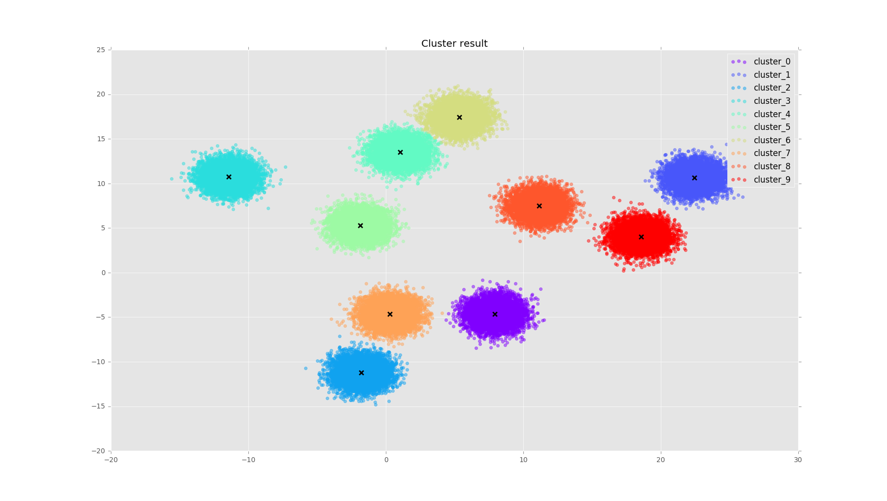

# Parallel k-means/k-means++

Yet another wheel.

# Usage

## Cluster

```bash
$ make
g++-7 -fopenmp -std=c++11 -Wall -Wfatal-errors -march=native -O2 -I include -c src/kmeans.cpp -o src/kmeans.o
mkdir -p bin
g++-7 -fopenmp -std=c++11 -Wall -Wfatal-errors -march=native -O2 -I include src/kmeans.o tests/cluster.cpp -o bin/cluster
g++-7 -fopenmp -std=c++11 -Wall -Wfatal-errors -march=native -O2 -I include src/kmeans.o tests/test_fit.cpp -o bin/test_fit
g++-7 -fopenmp -std=c++11 -Wall -Wfatal-errors -march=native -O2 -I include src/kmeans.o tests/test_predict.cpp -o bin/test_predict
g++-7 -fopenmp -std=c++11 -Wall -Wfatal-errors -march=native -O2 -I include src/kmeans.o tests/test_save_load_model.cpp -o bin/test_save_load_model
$ ./bin/cluster data/test_data 10 4  # use 4 threads to cluster test_data into 10 clusters
I 2017-08-20 22:37:51.636 set_num_cluster@kmeans.h:50] set number of clusters to 10
I 2017-08-20 22:37:51.637 set_num_threads@kmeans.h:44] set number of threads to 4
I 2017-08-20 22:37:51.637 fit@kmeans.cpp:361] loading data from data/test_data
I 2017-08-20 22:37:51.898 fit@kmeans.cpp:371] fitting data with n=70000 d=2 k=10
I 2017-08-20 22:37:51.898 fit@kmeans.cpp:375] seeding centers...
I 2017-08-20 22:37:51.909 fit@kmeans.cpp:382] start clustering...
I 2017-08-20 22:37:51.914 fit@kmeans.cpp:402] iter: 1 reassign_ratio: 1 cost: 270561
I 2017-08-20 22:37:51.916 fit@kmeans.cpp:402] iter: 2 reassign_ratio: 0.00182857 cost: 139494
I 2017-08-20 22:37:51.918 fit@kmeans.cpp:402] iter: 3 reassign_ratio: 4.28571e-05 cost: 139458
I 2017-08-20 22:37:51.918 fit@kmeans.cpp:405] finished
```

## Plot cluster result
```bash
./tools/plot_cluster.py data/test_data kmeans.labels kmeans.model
```

sample result:

